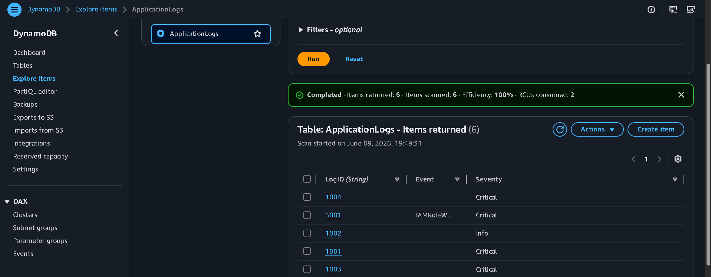
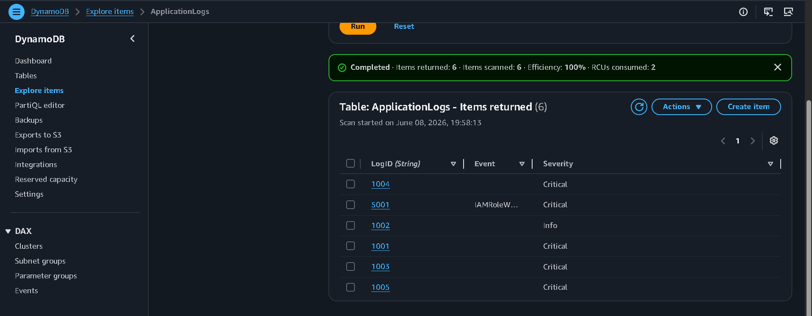
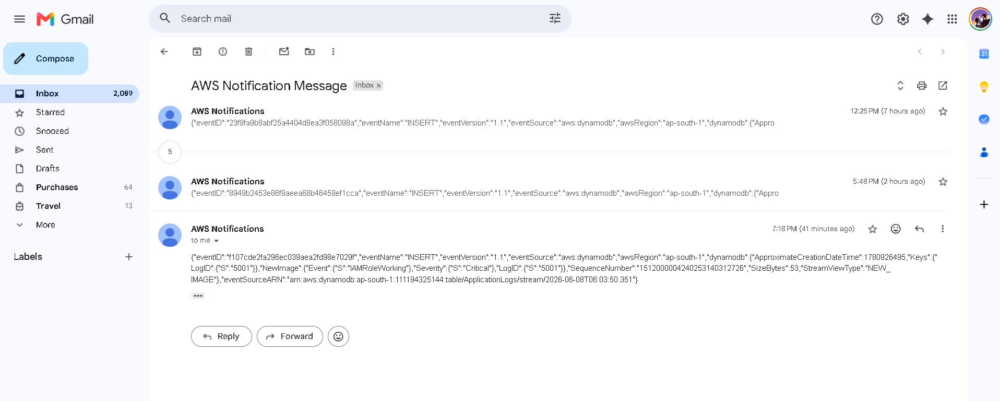

# aws-event-driven-alerting-system
How can critical application events automatically trigger alerts without constantly polling a database?
# 🚀 Real-Time Cloud Alerting System on AWS

## 📌 Overview

This project demonstrates an event-driven cloud architecture built on AWS that automatically generates email notifications whenever a critical event is detected.

The solution leverages DynamoDB Streams, EventBridge Pipes, and Amazon SNS to create a real-time alerting workflow without the need for polling or manual monitoring.

---

## 🏗️ Architecture

```text
Python (boto3)
      │
      ▼
Amazon DynamoDB
      │
      ▼
DynamoDB Streams
      │
      ▼
EventBridge Pipes
      │
      ▼
Amazon SNS
      │
      ▼
Email Notifications
```

---

## ⚙️ AWS Services Used

- Amazon DynamoDB
- DynamoDB Streams
- Amazon EventBridge Pipes
- Amazon SNS (Simple Notification Service)
- IAM Roles
- Amazon EC2
- Python (boto3)

---

## 🔄 Workflow

1. A Python application inserts log records into a DynamoDB table.
2. DynamoDB Streams capture INSERT and MODIFY events.
3. EventBridge Pipes consume stream events.
4. Events are forwarded to an SNS topic.
5. SNS sends email notifications to subscribed users.

---

## 📝 Sample Event

```json
{
  "LogID": "5001",
  "Severity": "Critical",
  "Event": "DiskFull"
}
```

---

## 📧 Example Notification Flow

```text
Critical Event
      │
      ▼
DynamoDB
      │
      ▼
DynamoDB Stream
      │
      ▼
EventBridge Pipe
      │
      ▼
SNS Topic
      │
      ▼
Email Alert
```

---

## 💻 Python Implementation

```python
import boto3

dynamodb = boto3.resource(
    'dynamodb',
    region_name='ap-south-1'
)

table = dynamodb.Table('ApplicationLogs')

table.put_item(
    Item={
        'LogID': '5001',
        'Severity': 'Critical',
        'Event': 'DiskFull'
    }
)

print("Log inserted successfully")
```

---

## 🎯 Key Concepts Learned

- Event-Driven Architecture
- IAM Roles and Permissions
- DynamoDB Data Modeling
- DynamoDB Streams
- Event Filtering
- Amazon SNS Pub/Sub Model
- AWS SDK for Python (boto3)
- Service Integration on AWS

---

## 📸 Screenshots

### DynamoDB Table



### EventBridge Pipe



### Email Notification



---

## 📁 Project Structure

```text
aws-event-driven-alerting-system/
│
├── README.md
├── requirements.txt
├── app.py
│
├── architecture/
│   └── architecture-diagram.png
│
└── screenshots/
    ├── dynamodb-table.png
    ├── eventbridge-pipe.png
    └── email-alert.png
```

---

## 🔮 Future Improvements

- Add Lambda for custom alert formatting
- Integrate Amazon CloudWatch metrics
- Build a web dashboard for monitoring
- Implement Infrastructure as Code (Terraform)
- Add CI/CD deployment pipeline

---

## 👨‍💻 Author

**Yashwardhan Rathaur**

AWS | Cloud Computing | DevOps | Software Engineering
